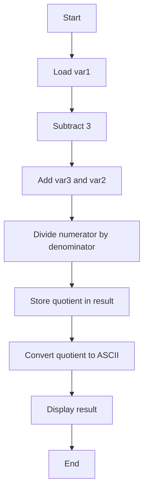
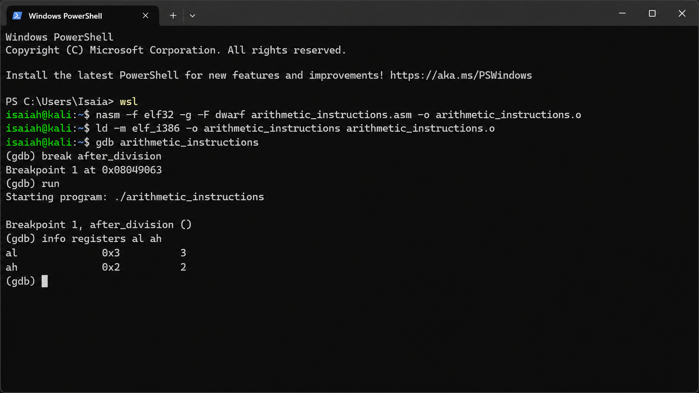
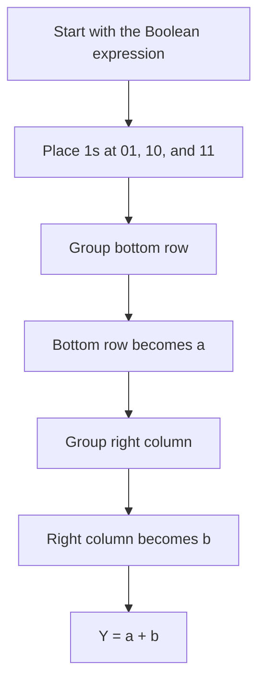
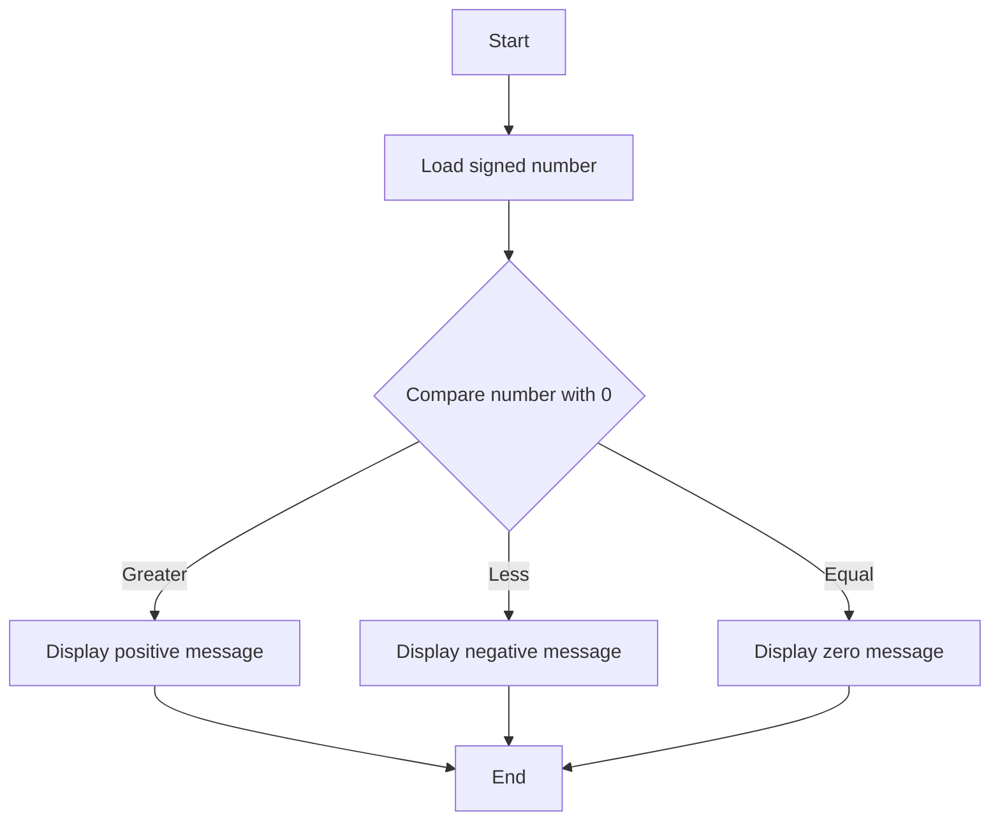

# mid-term-exam

## Question 1

Calculate `result = (var1 - 3) / (var3 + var2)`.

- `var1 = 20`
- `var2 = 2`
- `var3 = 3`
- Numerator: `20 - 3 = 17`
- Denominator: `3 + 2 = 5`
- Quotient: `3`
- Remainder: `2`

### Flowchart



### Assembly Code

```asm
; var1 = 20, var2 = 2, var3 = 3
; result = (var1 - 3) / (var3 + var2)
; expected quotient = 3, expected remainder = 2

section .data
    var1 db 20
    var2 db 2
    var3 db 3

section .bss
    result resb 1
    output resb 1

section .text
    global _start

_start:
    mov ax, 0
    mov al, [var1]
    sub al, 3

    mov bl, [var3]
    add bl, [var2]

    div bl

after_division:
    mov [result], al
    add al, '0'
    mov [output], al

    mov eax, 4
    mov ebx, 1
    mov ecx, output
    mov edx, 1
    int 0x80

    mov eax, 1
    mov ebx, 0
    int 0x80
```

| Register Name | Value |
|---|---:|
| `AL` — quotient | `3` |
| `AH` — remainder | `2` |

### GDB Verification

```text
nasm -f elf32 -g -F dwarf arithmetic_instructions.asm -o arithmetic_instructions.o
ld -m elf_i386 -o arithmetic_instructions arithmetic_instructions.o
gdb arithmetic_instructions
```

```gdb
layout asm
layout regs
break after_division
run
info registers al ah
```



## Question 2

Simplify `Y = a'b + ab + ab'`.

### Flowchart



### Completed K-Map

| `a \ b` | `0` | `1` |
|---|---:|---:|
| `0` | `0` | `1` |
| `1` | `1` | `1` |

### Groups

- Bottom row: `ab' + ab = a`
- Right column: `a'b + ab = b`

### Simplified Expression

`Y = a + b`

## Question 3

Determine whether a signed number is positive, negative, or zero.

### Flowchart



### Assembly Code

```asm
section .data
    number dd -7

    positive_msg db 'The number is positive', 10
    positive_len equ $ - positive_msg
    negative_msg db 'The number is negative', 10
    negative_len equ $ - negative_msg
    zero_msg db 'The number is zero', 10
    zero_len equ $ - zero_msg

section .text
    global _start

_start:
    mov eax, [number]
    cmp eax, 0
    jg positive
    jl negative

zero:
    mov ecx, zero_msg
    mov edx, zero_len
    jmp display

positive:
    mov ecx, positive_msg
    mov edx, positive_len
    jmp display

negative:
    mov ecx, negative_msg
    mov edx, negative_len

display:
    mov eax, 4
    mov ebx, 1
    int 0x80

    mov eax, 1
    mov ebx, 0
    int 0x80
```

With `number dd -7`, the output is `The number is negative`.
